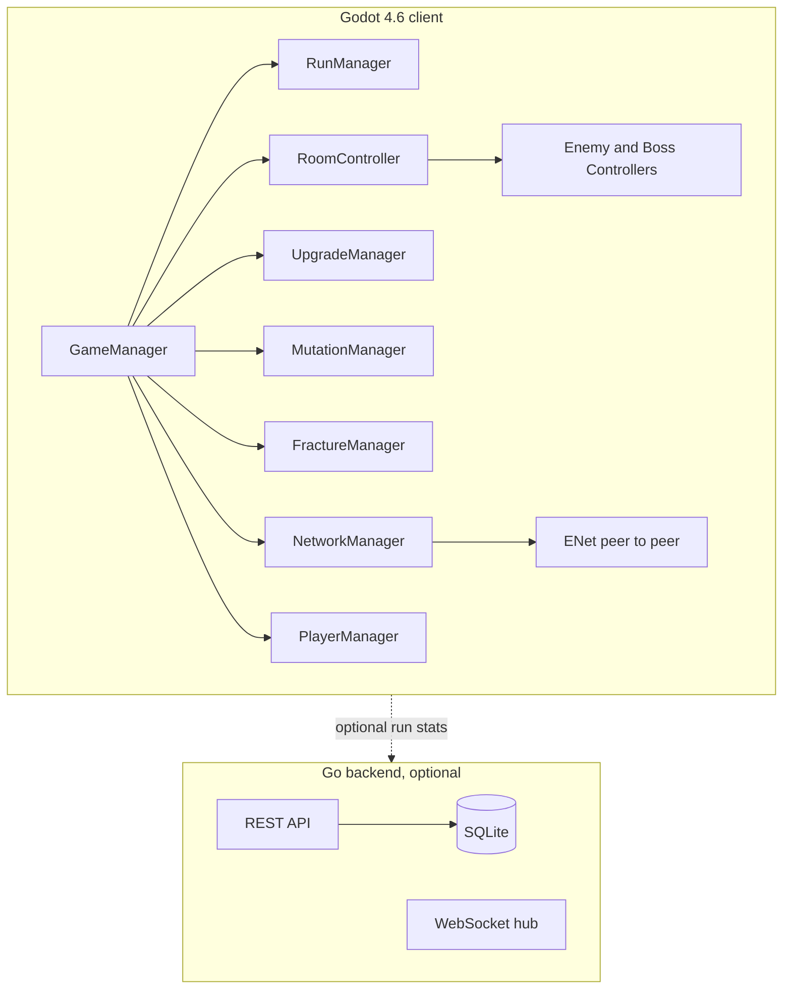
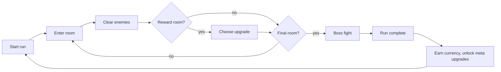
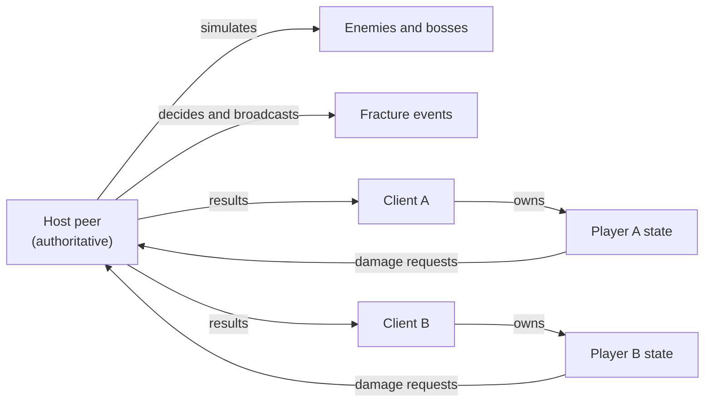

## rush-fracture
**break speed. survive chaos.**

a fast-paced fps roguelike built in godot 4.6, with procedural runs, build variety, and co-op/competitive multiplayer. a companion go backend provides optional stats and telemetry.

---

**quick note:** before anything else, i started this project without knowing gdscript. this project is co-developed with claude, which helped me learn godot scripting, structure systems properly, and assist with testing and validation throughout development.

---

## current state

the core loop is complete and playable end to end: procedural rooms, 8 enemy types, 2 bosses, 26 upgrades, 8 mutations, 7 fracture events, persistent meta progression, and co-op/race/pvp multiplayer.

a single art direction ("Grafted Brood," a bio-mechanical symbiont look) covers every weapon, enemy, boss, and room obstacle as imported 3D models. audio is still synthesized placeholder tones, not real sound design. difficulty and economy tuning has not been through a structured external playtest, so treat "balanced" as a goal rather than a verified claim.

see "known limitations" near the bottom before treating this as launch-ready.

---

## architecture at a glance



no autoloads or engine singletons: every manager is a plain node wired together in `game_manager.gd`. systems talk to each other through signals, not direct references. see `game-client/systems/` for the full subsystem breakdown.

---

## core gameplay loop



each run is 5 to 8 rooms and plays differently depending on the upgrades and mutations picked along the way.

---

## movement and combat

- fast fps movement with dash and air control
- momentum based feel, speed rewards mobility
- three weapon types:
  - **pulse rifle**: balanced hitscan with burst fire and armor piercing upgrades
  - **scatter cannon**: close range with tight spread and double blast options
  - **beam emitter**: continuous damage with heat management and chain/pierce upgrades
- combo system rewards consecutive kills with speed and damage buffs
- hit feedback: recoil, screen shake, damage vignette, hit markers

---

## build system

### upgrades (26 types)
- weapon specific: burst fire, armor piercing, ricochet, beam chain, tight spread, double blast
- global: damage, fire rate, speed, dash cooldown, health, kill heal
- special: chain reaction, adrenaline surge, temporal break, explosive dash, null field, enemy slow aura
- cursed: high reward with a real tradeoff, e.g. "power surge" (more weapon damage, faster enemies for the whole room, not just you)

### mutations (8 types)
run modifiers with a real downside attached, picked at fixed points in a run:
- glass cannon, momentum shield, fracture echo, overclock, temporal distortion, and three more

---

## enemies

eight enemy types with distinct behaviors:

| type | role |
|------|------|
| chaser | fast melee rusher |
| shooter | ranged attacker, raycast line of sight |
| tank | slow, high damage, high hp, elite slam |
| dasher | high speed flanker |
| exploder | suicide bomber |
| sniper | long range, fragile, telegraphed shots |
| support | buffs and heals nearby enemies |
| displacer | teleports, disrupts positioning |

scaling based on room difficulty, with elite variants. melee types steer around obstacles instead of walking straight into them.

---

## bosses

- **fracture titan**: final boss, two phases. ground slams, shockwaves, charge attacks. spawns adds in phase 2. if you stay out of range too long it closes the distance with a charge instead of standing there.
- **fracture warden**: mid-run miniboss. shield pulses, summons minions in phase 1, teleport slams in phase 2 that ignore distance entirely.

both have telegraphed attacks meant to be readable but punishing.

---

## room system

procedural but structured: 5 to 8 rooms per run.

- room types: combat, swarm, elite, recovery, hazard, gauntlet, elite chamber
- difficulty scales per room, with adaptive difficulty tracking in solo play
- obstacle layout varies per room (an even ring, clustered cover, or a corridor with a clear lane), not just obstacle count
- environmental hazards: spike zones, damage tiles, lava pits
- visual palette varies per room

---

## fracture events

temporary chaos modifiers that can trigger mid-run:

- low gravity
- unstable gravity
- velocity surge
- enemy speed boost
- random explosions
- vision distortion
- enemy duplication

in co-op, the host decides whether and which fracture triggers, then broadcasts it, so every player in the room gets the same event at the same time.

---

## multiplayer



ENet based, listen server (the host is also a player), room code join flow with a direct IP field for cross machine play on a LAN. no NAT traversal or relay yet, so play across the open internet needs the host to port forward.

- **co-op**: shared run, synchronized enemies and per-player upgrades
- **race**: players progress separately, meet later for a pvp encounter
- **pvp encounter**: players fight using their builds mid-run

enemies and shared events are host authoritative. each player owns their own character's state, with damage and hit registration routed through the host so results agree across every connected peer.

---

## progression

persistent across runs, saved locally:

- lifetime stats: kills, combos, times, wins
- fracture shards currency earned per run
- meta upgrades: damage, speed, health, dash cooldown, shard bonus
- unlockables: weapon variants and starting perks
- settings persist: volume, sensitivity, fullscreen, invert mouse, key bindings

---

## art and audio

a single committed art direction, "Grafted Brood," a bio-mechanical symbiont grafted onto tech and architecture. `game-client/assets/models/` holds imported 3D models covering all 3 weapons, all 8 enemies, both bosses, and all 9 room obstacle types, built from a shared 5 material vocabulary (chitin, bone, membrane, glow, graft).

audio is still fully synthesized placeholder tones generated at runtime, no sound files on disk yet. no game icon, no UI font, no marketing assets.

---

## controls

| action | key |
|--------|-----|
| move | WASD |
| look | mouse |
| shoot | left click |
| jump | space |
| dash | shift |
| weapons | 1 / 2 / 3 |
| toggle hud | F2 |
| debug overlay | F3 (debug builds only) |
| pause/menu | escape |

gamepad is also supported (left stick move, right stick look, A jump, B dash, right trigger shoot, d-pad weapon select). key bindings are remappable in settings.

---

## running the project

1. open `game-client/` in godot 4.6+
2. run the main scene (`main_menu.tscn`)
3. for multiplayer: one player hosts, others join by room code, with an IP field for cross machine play on the same network
4. optional: run the backend for stats tracking, see below

export presets are included for windows and macos. no linux export preset yet.

---

## deployment

### game client

the client is a standard godot export, there is no server dependency for solo or LAN play.

1. install export templates matching the godot 4.6 editor version
2. `Project > Export` in the editor, pick the windows or macos preset
3. windows builds are unsigned (expect a SmartScreen warning), macos builds are unsigned and unnotarized (expect Gatekeeper to block them by default)

### backend (optional, for stats tracking)

the backend is a stateless go binary plus a SQLite file, deployable anywhere that can run a docker container.

```bash
cd backend
cp .env.example .env   # set a real API_KEY before going anywhere near the open internet
docker compose up --build -d
```

this builds the two stage `Dockerfile` (CGO enabled, required by the sqlite driver), runs the api on port 8080 with a persistent volume for the database, and checks `/health` on an interval. without docker, `go run ./cmd` works directly against a local SQLite file.

the client does not call this backend yet. it exists as a standalone service, ready to be wired in when server side stats or leaderboards are needed.

#### api summary

| method | path | purpose |
|--------|------|---------|
| GET | /health | liveness and db connectivity check |
| POST | /api/users | create a user |
| GET | /api/users/{id} | fetch a user |
| POST | /api/runs/start | start a run |
| POST | /api/runs/{id}/end | submit run results |
| GET | /api/runs/{id} | fetch a run |
| POST | /api/runs/{id}/rooms/enter | log a room entered event |
| POST | /api/runs/{id}/rooms/clear | log a room cleared event |
| POST | /api/runs/{id}/upgrade | log an upgrade choice |
| GET | /api/runs/{id}/events | fetch a run's event log |
| GET | /api/stats/{userId} | aggregate stats for a user |
| GET | /ws | websocket upgrade (broadcast hub, not yet wired to any real time feature) |

every route except `/health` is gated behind an `X-API-Key` header when `API_KEY` is set, rate limited per IP, and body size capped. this is not per-user authentication, it only keeps the api from being wide open to the public internet.

---

## architecture notes

- modular systems: combat, rooms, enemies, upgrades, mutations, networking, progression, all under `game-client/systems/`
- strict gdscript typing throughout
- signal driven communication between systems, not polling
- the 8 standard enemies share `enemy_base.gd`, both bosses share `boss_base.gd`
- host authoritative multiplayer for enemies and shared events, per-player authority for each player's own character
- atomic save writes (write to a temp file, rename over the real path) so a crash mid save cannot corrupt progression

---

## project structure

```
rush-fracture/
  game-client/
    scenes/          godot scene files
    scripts/         game manager, debug overlay
    systems/         all game systems: combat, enemy, player, rooms, ui, network, progression, audio
    assets/models/   imported Grafted Brood 3D models
  backend/           go server for stats and telemetry, optional, not yet called by the client
```

---

## known limitations

being upfront about what is not done yet:

- audio is placeholder tones, not real sound design or music
- no game icon, UI font, or marketing assets
- multiplayer beyond a LAN needs manual port forwarding, no relay or matchmaking service
- no automated playtesting has validated difficulty or economy balance
- no accessibility features (colorblind modes, text scaling) or localization
- linux export preset does not exist yet, windows and macos builds are unsigned

a more detailed internal audit exists in the working tree but is intentionally not tracked in this repository.

---

## notes

this project started as a learning exercise and grew into a complete, playable game. the goal was to build something real, learn godot and multiplayer networking along the way, and keep it enjoyable to work on.
